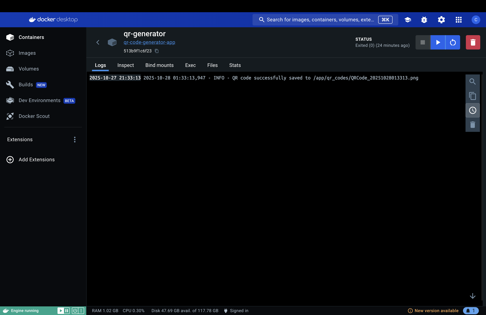

Small utility to generate QR codes and an example Docker image for running the project.

## Prerequisites

- Docker installed and the daemon running
- Python 3.9+ to run locally (if not using Docker)
- Optional: `pytest` for running tests

## Build the Docker image

From the project root (where `Dockerfile` is located) run:

docker build -t
qr-code-generator-app .

This builds an image tagged `module7_is601:latest`.

## Run the container

docker run -d --name qr-generator -v .:/app/qr_codes qr-code-generator-app --url www.njit.edu

Example (sample) docker log output:

```
INFO:root:QR code successfully saved to /app/qr_codes/QRCode_20251027094500.png
172.17.0.1 - - [27/Oct/2025:09:45:00 +0000] "GET / HTTP/1.1" 200 -
```



## Run tests

If you want to run the project's tests locally:

```bash
python -m pip install -r requirements.txt
python -m pip install pytest
pytest -q
```

- If `docker build` fails, check the build output for errors and make sure the Docker daemon has sufficient resources.
- If `docker logs` shows permission or file errors, ensure the container has access to the directories it needs and that any environment variables are set.

## Example QR code

The repository includes an example QR code generated by the app. You can view it below:


## Docker image (Docker Hub)

The image was pushed to Docker Hub under the `containop` namespace. Visit the image page here:

[containop/qr-code-generator-app on Docker Hub](https://hub.docker.com/r/containop/qr-code-generator-app)

You can pull and run the published image without building locally:

```bash
docker pull containop/qr-code-generator-app:latest
docker run -d --name qr-generator -v "$(pwd)/qr_codes:/app/qr_codes" containop/qr-code-generator-app:latest --url https://www.njit.edu
```

If you prefer to build locally, the `docker build` instructions earlier in this README still apply.
